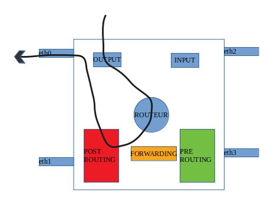
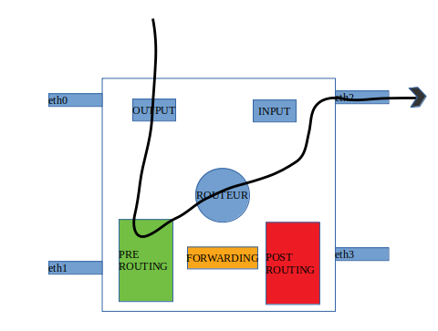
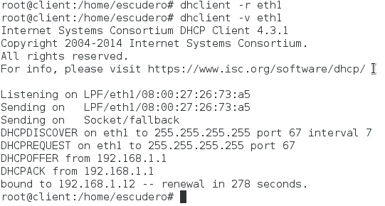
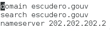

# TP Mise en place d'un réseau "d'entreprise"

Ce dépôt git est un répertoire de documentation du TP d'installation d'un réseau d'entreprise. Il comprend :
- L'architecture des réseaux
- La réponse aux différentes questions
- Les observations et les tests réalisés
- Un compte rendu sur les évolutions à apporter au projet

## Sommaire

  * [Partie I: Mise en place du réseau sur les VMs](#partie-i-mise-en-place-du-réseau-sur-les-vms)
  * [Partie II: Interconnexion avec le "reste du monde"](#partie-ii-interconnexion-avec-le-reste-du-monde")
  * [Partie III: Communication du réseau privé avec les serveurs web](#partie-iii-communication-du-réseau-privé-avec-les-serveurs-web)
  * [Partie IV: Mise en place de la sécurité](#partie-iv-mise-en-place-de-la-sécurité)
  * [Partie V: Configuration automatique](#partie-v-configuration-automatique)
  * [Conclusion / Compte rendu](#conclusion/compte-rendu)
  
  ## Partie I: Mise en place du réseau sur les VMs 
  
  `nano /etc/network/interfaces`
  
  
  ### Etape 1.1-Réseau privé de l'entreprise
  
  Pour le réseau privé de l'entreprise nous choisissons une adresse privée avec un masque de sous réseau 255.255.255.0 afin de permettre 2^7-2 soit 126 machines de se connecter ce qui est amplement suffisant dans notre architecture
  
  Pour commencer il faut définir un réseau sur l'interface de notre routeur relié à notre réseau local
  
  éditer le fichier `/etc/network/interfaces`
  
  configurer une interface avec une adresse statique
  
  ```bash
  auto eth1
  iface eth1 inet static
     address 192.168.1.1 # adresse physique de l'interface eth1 qui sera la passerelle du réseau privé
     netmask 255.255.255.0 # masque de sous réseau de l'interface eth1
     network 192.168.1.0 # Réseau de eth1
  ```
  
  ### Etape 1.2-Réseau public de l'entreprise (DMZ)
  
  
  
  Pour ce qui est de la zone démilitarisée (DMZ) de notre entreprise nous choisissons un réseau privé différent de celui de la partie privée toujours en /24.
  
  Il faut alors ajouter un autre réseau sur une des interfaces du routeur
  
  ```bash
  auto eth2
  iface eth2 inet static
     address 192.168.2.1 # adresse physique de l'interface eth1 qui sera la passerelle du réseau de la DMZ
     netmask 255.255.255.0 # masque de sous réseau de l'interface eth2
     network 192.168.2.0 # Réseau de eth2
  ```
  

  
  ### Etape 1.3-Interconnexion des réseaux de l'entreprise
  
  Il faut pour cela activer le routage sur notre routeur 
  
  > Editer `/etc/sysctl.conf`
  
  > Décommenter la ligne suivante `net.ipv4.ip_forward=1`
  
  > Valider les nouvelles modifications ajoutées au fichier /etc/sysctl.conf `sysctl -p`
  
  Nos réseaux sont à présent interconnectés car le routeur remplit automatiquement sa table de routage avec l'ensemble des réseaux pour lequel il est interconnecté.
  
  ### Questions
  
  #### Question 1.1
  
  L'intérêt majeur d'avoir une DMZ au sein de son entreprise est de distinguer le réseau privé et l'ensemble des services qui peuvent être consultés par le reste du monde. 
    
  
  
  #### Question 1.2
Enchaînement des messages entre un client et un serveur de la DMZ :
+ N'ayant pas d'interface dans le réseau cible (celui de la DMZ), le client transmet sa demande de connexion à l'interface du routeur de son réseau, celui-ci étant déclaré comme une passerelle vers le réseau de la machine cible.
+ Le routeur transmet la demande de connexion directement au serveur, comme il possède une interface dans le réseau de la DMZ.
+ Le serveur reçoit la demande de connexion et génère à son tour une demande de connexion ainsi qu'un acquitement
+ Le serveur renvoie la réponse qui fait le chemin inverse à celui de la requête
+ Le client envoie un acquitement vers le serveur par le chemin qui est désormais connu
+ Le client envoie sa requête au serveur
+ Le serveur reçoit la requête et va chercher une réponse ou la génère à partir d'un script
+ Le serveur envoie sa réponse au client
+ Le client traite l'information pour la rendre accessible à l'utilisateur (ex : affichage à l'écran)
Contrairement à un cas classique, aucune opération de masquerading n'est nécessaire puisque notre réseau est isolé du reste du monde.
  
  #### Question 1.3
  
  Pour ajouter des routes permanentes il faut se rendre dans la configuration des interfaces réseau et rajouter sous l'interface:
  
  `up route add -net <reseau> netmask <mask> gw <passerelle>`
  
  Les routes définies sont :
  
##### Pour une machine du réseau privé

Destination  | Passerelle    | Masque        | Interface
------------ | ------------- | ------------- | -------------
0.0.0.0      | 192.168.1.1   | 0.0.0.0       | eth1

  Le client ayant seuelement une interface relié au client on indique alors grâce à une route par défaut que tous les paquets doivent sortir par eth1 qui est relié à l'interface du routeur correpondant à la passerelle.
##### Pour un serveur de la DMZ :
  Destination  | Passerelle    | Masque        | Interface
  ------------ | ------------- | ------------- | -------------
  0.0.0.0      | 192.168.2.1   | 0.0.0.0       | eth1
##### Pour le routeur:
  Destination  | Passerelle    | Masque        | Interface
  ------------ | ------------- | ------------- | -------------
  192.168.1.0  | 0.0.0.0       | 255.255.255.0 | eth0
  192.168.2.0  | 0.0.0.0       | 255.255.255.0 | eth1
  
  ## Partie II: Interconnexion avec le "reste du monde"
  
  ### Etape 2.1-Mise en place d'un routeur vers l'extérieur
  
  ### Questions
  
  #### Question 2.1
  On doit d’abord ajouter sur les routeurs de chaque entreprise des interfaces qui permettront de les relier au routeur vers l’extérieur (routeur central).
Ensuite sur le routeur central, on rajoutera les routes qui relieront tous les routeurs d’entreprises entre eux
Ainsi, chaque entité du réseau public d’une entreprise aura accès aux serveurs webs des autres entreprises.
Ajout des routes sur le serveur central:

  ##### Pour le routeur de chaque entreprise:
  Destination  | Passerelle    | Masque        | Interface
  ------------ | ------------- | ------------- | -------------
  192.168.1.0  | 0.0.0.0       | 255.255.255.0 | eth0
  192.168.2.0  | 0.0.0.0       | 255.255.255.0 | eth1
  21X.21X.21X.0| 21X.21X.21X.1 | 255.255.255.252 | eth2
  
  Sur le routeur de chaque entreprise il faut spécifier également une route vers les serveurs des autres entreprises en passant par l'interface reliée au monde extérieure
  
  X numéro du binôme
  Il faut ajouter une route vers le monde extérieur.
  
  ##### Pour le routeur de jonction:
  Destination  | Passerelle    | Masque        | Interface
  ------------ | ------------- | ------------- | -------------
  211.211.211.0| 21X.21X.21X.2 | 255.255.255.252 | ethO
  212.212.212.0| 212.212.212.2 | 255.255.255.252 | eth1
  213.213.213.0| 213.213.213.2 | 255.255.255.252 | eth2
  214.214.214.0| 214.214.214.2 | 255.255.255.252 | eth3
  
  Il faut également ajouter les routes pour diriger les connexions vers les serveurs de chaque entreprise en spécifiant l'interface relié au routeur en question.
  
  
  #### Question 2.2
  Ce sont les réseaux privés de chaque entreprise qui ne communiquent pas avec le reste du monde car ayant des adresses privées, ils ne peuvent pas accéder à l’extérieur.
  
  ## Partie III: Communication du réseau privé avec les serveurs web
  
 ### Etape 3.1-Réseau privé
 
 Le réseau privé de notre DMZ est 192.168.2.0/24
  
  Cependant notre serveur doit pouvoir être rejoint à l'adresse publique 202.202.202.2
  
  pour cela nous devons faire en sorte de masquer tous les paquets venant sur eth2 qui est l'interface directement connectée à la DMZ
  
  `iptables -t nat -A POSTROUTING -o eth2 -j MASQUERADE`
  
  - "-t nat" spécifie que l'on souhaite modifier la table nat
  
  - "-A" pour "append" permet d'ajouter une nouvelle règle
  
  - "POSTROUTING" action après le routage
  
  - "-o iface" s'applique sur l'interface output
  
  - "-j" jump
  
  - "MASQUERADE" le paquet sortant sur l'interface de sortie est masqué par l'adresse de cette même interface
  
  Par la suite il faut spécifier que tous les paquets sortant du réseau privé avec l'adresse 202.202.202.2 de notre serveur soit directement relié à l'adresse privée du serveur
  
  `iptables -t nat -A PREROUTING -i eth1 -d 202.202.202.2 -j DNAT --to-destination 192.168.2.2`
  
  - "PREROUTING" avant le routage
  
  - "-i iface" s'applique sur l'interface input 
  
  - "-d 202.202.202.2" adresse de destination
  
  - "-j DNAT --to-destination 192.168.2.2" redirige vers 192.168.2.2 qui est connu par notre routeur
  
 
 ### Questions
 
 #### Question 3.1
 
 NAT : Network Address Translation

NAT présente plusieurs avantages. Tout d’abord, le NAT a permis de répondre au problème de pénurie d’adresses sur Internet. Des plages d’adresses ont donc été réservées à une utilisation privée. En effet, tous les réseaux n’ont pas vocation à être accessibles depuis l’extérieur. De plus NAT permet également d’assurer la sécurité d’un réseau interne, en cachant sa topologie invisible au monde extérieur. En général, le NAT est implémenté sur un routeur.



Dans le cas ci-dessus on indique que les paquets après avoir été routés par la machine seront masqués par l'adresse de l'interface eth0. (MASQUERADE)



Dans le cas ci-dessus on va spécifier que tout paquet provenant avec une adresse de destination spécifique sera redirigé vers un réseau connu par notre routeur (DNAT)
 
 #### Question 3.2
 
 A présent les clients des réseaux privés de chaque entreprise peuvent accéder aux DMZ des autres réseaux d'entreprise. Cependant dans notre configuration actuelle, les clients n'ont pas accès à Internet.
  
  ## Partie IV: Mise en place de la sécurité
  
  
  
  ### Etape 4.1-Politique de sécurité
  
  ### Etape 4.2-Mise en place de la politique choisie
  
  ### Questions
  
  ```bash
  #!/bin/sh
  # Supprime toutes les règles existantes
  #!/bin/sh

  # Supprime toutes les règles existantes
  iptables -F

  #*************Politiques***************

  # Bloque l'ensemble des connexions entrantes
  iptables -P INPUT DROP

  # Bloque l'ensemble des connexions sortantes
  iptables -P OUTPUT DROP

  # Bloque l'ensemble des connexions forwardées
  iptables -P FORWARD DROP

  # Connexions déjà établies
  iptables -A INPUT -m state --state ESTABLISHED,RELATED -j ACCEPT
  iptables -A OUTPUT -m state --state ESTABLISHED,RELATED -j ACCEPT

  # AUtoriser le loopback
  iptables -A INPUT -i lo -j ACCEPT
  iptables -A OUTPUT -o lo -j ACCEPT

  # SSH
  iptables -A INPUT -p tcp --dport 22 -j ACCEPT

  # HTTP
  iptables -A INPUT -p tcp --dport 80 -j ACCEPT

  # ICMP
  iptables -A INPUT -p icmp -j DROP
  iptables -A OUTPUT -p icmp -j ACCEPT
  ```
  
  
  #### Question 4.1
  
  #### Question 4.2
  
  ## Partie V: Configuration automatique
  
  ### Etape 5.1-DHCP sur réseau privé
  
  Pour notre serveur DHCP nous avons décidé d'utiliser l'outils isc-dhcp-server fournit sur la distribution de Debian 8. Afin, pour un choix de simplicité nous avons installer le serveur DHCP sur chacun des réseaux de notre entreprise.
  
  Pour cela nous devons installer le paquet après avoir mis à jour l'ensemble des dépots APT
  
   `#apt-get update`
   
   `apt-get install isc-dhcp-server`
   
   
   #### Question 5.1
   
   Par la suite nous devons configurer notre serveur DHCP pour qu'il puisse attribuer dynamiquement les adresses ip à l'ensemble des machines de notre réseau privé
   
   A l'aide de l'éditeur de texte **nano** il faut apporter des modifications au fichier de configuration de notre dhcp présent dans **/etc/dhcp/dhcpd.conf**

puis modifier la section suivante:

```bash
# spécifie le nom de domaine aux clients
option domain-name "escudero.gouv";

# spécifie le serveur DNS aux clients
option domain-name-servers "srv-escu.escudero.gouv";

# Serveur DNS
option domain-name-servers 202.202.202.2;

# réseau sur lequel s'applique le DHCP
subnet 192.168.1.0 netmask 255.255.255.0 { 
   # définition d'une plage d'adresse à attribuer aux clients
   range 192.168.1.4 192.168.1.21; 
   # spécifie la passerelle par défaut pour les clients
   option routers 192.168.1.1;     
}
```
Informations à renseigner | Informations à véhiculer
------------ | -------------
Réseau sur lequel s'applique de DHCP | Passerelle par défaut
La plage d'adresse à attribuer aux clients | nom de domaine + serveur DNS


Puis spécifier le port d'écoute en modifiant `/etc/default/isc-dhcp-server`

`INTERFACES="eth1"` ==> Interface d'écoute
  
 
  
  #### Question 5.2
  
  Sur notre client:
  
  `dhclient -r <interface>` permet de supprimer la configuration précédente 
  
  `dhclient -v <interface>` permet de demander une nouvelle configuration réseau de la part du serveur DHCP
  
  On peut voir ci-dessous l'enchainement des informations transmises par notre serveur DHCP
  
  
  
  
  **DHCP** pour **D**ynamic **H**ost **C**onfiguartion **P**rotocol est un protocol permettant d'attribuer une configuration réseau automatique des clients sur le réseau.
  
  sur l'image ci-dessus nous pouvons voir l'ensemble des échanges entre notre client et le serveur 
  
   **DHCPDISCOVER** Le client localise le serveur DHCP
   
   **DHCPREQUEST** Le client envoit une requête au DHCP
   
   **DHCPOFFER** Réponse du serveur avec les premiers paramètres
   
   **DHCPACK** Réponse du DHCP qui contient l'adresse IP du client,son nom de domaine, sa passerelle,le serveur DNS
  
   Les informations de résolution de domaine sont également complétés
  
  
   
  #### Question 5.3
  
  Il se peut que sur le réseau il n'y ait pas assez d'adresse IP disponible dans la plage d'adresse atribuée au réseau ne permettant alors de pas pouvoir équiper l'ensemble des clients du LAN.2galement si une machine sur le LAN modifie son adresse IP en statique il peut survenir un conflit d'adresse sur le réseau.  
  
 
  
  
  ## Partie VI : Mise en place d'un proxy web
  
   A présent, notre objectif est de configurer un proxy http (on peut également configurer un proxy en ftp).
Dans un premier temps nous allons mettre en place un proxy cache web, puis un proxy cache transparent.

  ### Etape 6.1-Proxy cache web
  
  #### Installation d'un proxy web
  
  Nous avons choisi d'installer le proxy sur le routeur.
  Installation de Squid3: `apt-get install squid3`.
  
  #### Configuration du proxy
  
   Une fois le proxy installé on copie le fichier de configuration par défaut :
      
  `mv /etc/squid3/squid.conf /etc/squid3/squid.conf.old`
  
   On peut supprimer tous les commentaires du fichier, pour rendre l'edition plus facile:
   
   `grep -vE “^#|^$” /etc/squid3/squid.conf.old > /etc/squid3/squid.conf`
   
   On doit ensuite ajouter la règle de filtrage suivante:
   Redirection du port 80 vers le port 3128
   
   `iptables -A PREROUTING -i eth1 -p tcp --dport 80 -j REDIRECT --to-port 3128`
   
  #### Bloquer des noms de domaines
   
   Pour bloquer des sites webs, on peut créer un fichier texte contenant la liste des noms de domaines à bloquer.
   
   Puis on ajoute les lignes suivantes dans le fichier de configuration "squid.conf" :
   
  `acl deny_domain url_regex -i "/etc/squid/denydomain.txt"
    
   http_access deny deny_domain`
   
  #### Logs
  
   Les logs du serveur proxy sont stockés dans le fichier "/var/log/squid3/access.log"
   
  #### Configuration du navigateur
  
   Ensuite nous avons configuré le navigateur côté "client" de la manière suivante :
   
   Sur firefox: Menu > Préférences > Général > Paramètres Réseau > Paramètres
   
   
  
  ### Etape 6.2-Proxy cache transparent
  
  Pour mettre en place un proxy transparent on doit modifier une ligne dans le fichier squid.conf de la manière suivante: 
  `http_port: 3128 transparent`. 
  
  Nous avons installé le proxy Squid sur le routeur de notre réseau. Il est donc plus facile de le mettre en place que si nous avions dédié une machine pour le proxy.
  
  
  ### Questions
  
  #### Question 6.1
  
  Un proxy ou également appelé serveur mandataire permet de suivre les échanges réseaux entre un client et un serveur, cela va permettre de garantir l'anonymat ou de crypter les données.
 
  Sécurité et performance justifient l'utilisation d'un proxy web. 
  En effet, il possède plusieurs avantages pour un réseau d'entreprise :
  
- Il empêche l’accès à des sites webs dangereux pour l’entreprise.
- Il met en cache des pages webs ou des fichiers afin d’accélérer leurs accès par les utilisateurs.
- Par conséquent, cela peut augmenter les performances du réseaux.

  #### Question 6.2
  
 On peut avoir différentes utilisations d'un proxy-web:
  - Explicite : Les utilisateurs doivent configurer leurs applications ou navigateurs.
  - Implicite : « Proxy transparent » : Les utilisateurs n’ont pas besoin de configurer leur application ou leur navigateur.
  
 Il existe plusieurs raisons d’utiliser un proxy web transparent à la place d’un proxy web classique et explicite :
  - Facilité d’utilisation : les utilisateurs n’ont pas besoin de savoir comment configurer leurs application ou leur navigateur.
  - Les utilisateurs ne connaissent pas l’existence du proxy. Pour une entreprise, cela permet de surveiller l’activité de leurs employés.

  
  #### Question 6.3
 
Un proxy transparent est plus complexe d'un point de vue réseau si il est installé sur une machine dédiée. Cette méthode est plus sécurisée que celle où on installe le proxy sur le routeur. Cependant cela nous oblige à mettre plus de règles de filtrage en place.
  
  ## Partie VII : DNS
  
  ### Etape 7.1-Espace de nommage
  
  Pour mettre en place un alias sur une machine, ajouter dans /etc/hosts une ligne de la forme :
  @IP alias
  
  ### Etape 7.2-Serveur DNS
  
  ##### Configuration du serveur DNS
  
  Nous devons dans un premier temps connaître le nom de la machine où le service **bind** va être installé
  
  `hostname` ==> permet de connaître le nom de la machine
  
  `hostname <nouveau_nom>` ==> permet de changer le nom de la machine
  
  Nous pouvons ensuite mettre à jour l'ensemble des dépots APT avec `apt-get update` pour pouvoir installer le paquet **BIND9** qui est un service DNS entièrement configurable sur les distributions DEBIAN ou UBUNTU
  `apt-get install bind9`
  
  il faut par la suite créer le fichier db.domain.xx en utilisant le modèle du fichier **db.local** présent dans **/etc/bind/**
 
  
  `cp /etc/bind/db.local /etc/bind/db.domain.xx` puis l'éditer avec nano
  
  ```bash
  ;
  ; BIND data file for domain.xx
  ;
  $TTL    604800
  @       IN      SOA     <nom-serveur>.domain.xx. root.domain.xx. (
                                2         ; Serial
                           604800         ; Refresh
                            86400         ; Retry
                          2419200         ; Expire
                           604800 )       ; Negative Cache TTL
  ;
  domain.xx.  IN      NS      <nom-serveur>.domain.xx
  domain.xx.  IN      A       <ip-serveur-dns>

  <nom-serveur> IN    A  <ip-serveur-dns>      

  www     IN CNAME domain.xx.
  @       IN      AAAA    ::1
  
  
  Configuration du reverse DNS afin d'associer une adresse IP au nom de domaine
  
  ```bash
  ;
  ; BIND reverse data file for escudero.gouv
  ;
  $TTL    604800
  @       IN      SOA     <nom-serveur>.domain.xx root.domain.xx. (
                                1         ; Serial
                           604800         ; Refresh
                            86400         ; Retry
                          2419200         ; Expire
                           604800 )       ; Negative Cache TTL
  ;
  @       IN      NS      <nom-serveur>.
  2       IN      PTR     <nom-serveur>domain.xx.


Le **2** dans la zone pointée (PTR) correspond à l'octet de la partie hôte de l'adresse IP publique de notre serveur (ex: 202.202.202.**2**

  ```
  
  ```
  Configuration des zones de notre domaine dans **/etc/bind/named.conf.local**
  
  ```bash
  //
  // Do any local configuration here
  //

  // Consider adding the 1918 zones here, if they are not used in your
  // organization
  //include "/etc/bind/zones.rfc1918";
  zone "domain.xx" {
          type master;
          file "/etc/bind/db.domain.xx";
          allow-query { any; };
  };
  //XXX.XXX.XXX 3 octets de l'adresse IP inversé
  zone "XXX.XXX.XXX.in-addr.arpa" {
          type master;
          file "/etc/bind/db.domain.xx.inv";
  };
  ```
  
  


  Configuration des forwarders afin de rediriger vers d'autres serveurs DNS les domaines inconnu de notre serveur DNS dans **/etc/bind/named.conf.options**
  
  ```bash
  options {
        directory "/var/cache/bind";

        // If there is a firewall between you and nameservers you want
        // to talk to, you may need to fix the firewall to allow multiple
        // ports to talk.  See http://www.kb.cert.org/vuls/id/800113

        // If your ISP provided one or more IP addresses for stable
        // nameservers, you probably want to use them as forwarders.
        // Uncomment the following block, and insert the addresses replacing
        // the all-0's placeholder.

         forwarders {
                <ip-serveur-privé>;
                //autres forwarder
                8.8.8.8
         };

        //========================================================================
        // If BIND logs error messages about the root key being expired,
        // you will need to update your keys.  See https://www.isc.org/bind-keys
        //========================================================================
        dnssec-validation auto;

        auth-nxdomain no;    # conform to RFC1035
        allow-recursion { localnets; };
        listen-on-v6 { any; };
   };

  ```
  Par la suite sur le serveur DNS il faut enlever tous les serveurs DNS dans le fichier `/etc/resolv.conf` puis grâce à la commande `nslookup` on peut testet sur notre serveur
  
  ```bash
  root@srv-escu:/home/escudero# nslookup
  > escudero.gouv
  Server:         127.0.0.1
  Address:        127.0.0.1#53

  Name:   escudero.gouv
  Address: 202.202.202.2
  >

  ```
  
  on voit que le domaine escudero.gouv est associé au serveur soit l'adresse de loopback **127.0.0.1**
  
  on peut également essayé en ajoutant le nom du serveur **srv-escu**
  
  ```bashroot@srv-escu:/home/escudero# nslookup
  > srv-escu.escudero.gouv
  Server:         127.0.0.1
  Address:        127.0.0.1#53

  Name:   srv-escu.escudero.gouv
  Address: 202.202.202.2
  >
  ```
  
  ##### Configuration sur le client
  
  Il faut tout d'abord ajouté le serveur DNS dans le fichier `/etc/resolv.conf`
  
  `nameserver <ip-serveur-dns>`
  
  puis tester avec `nslookup`
  
  

  ### Etape 7.3-Service global
  
  ### Questions
  
  #### Question 7.1
  
  + Le client demande au serveur DNS de résoudre une URL (ex : machine.extension1.extension2)
  + Le serveur DNS est également le serveur racine. Il interroge le serveur "extension 2" qui lui donne l'IP du serveur "extension 1"
  + Le serveur DNS interroge le serveur extension 1 qui le donne l'IP de la machine "machine"
  + Le serveur DNS interroge la machine "machine"
  + Le serveur DNS renvoit la réponse vers le client qui enregistre l'ip associé à machine.extension1.extension2 dans son cache
  
  ## Compte rendu
  
  La mise en place d'un réseau "d'entreprise" était pour la plupart des membres du groupe un projet inédit. En effet, parmi nous 3 viennent d'un DUT Informatique. Ce fut l'occasion d'acquérir des connaissances sur la mise en place de routeurs, de proxy, de serveur DNS ....
  
  Sur le plan technique nous n'avons pas réussi à finir la totalité du TP. Nous avons rencontré quelques difficultés avec le proxy web, la liste de contrôle d'accès (ACL) était mal définie. Enfin tous les membres n'ont pas eu le temps de mettre en place une politique de sécurité.
  
  Plusieurs améliorations pourraient être apportées aux réseaux mis en place. En effet, nous aurions pu utiliser plus de machines pour augmenter la sécurité de notre réseau. Par exemple, nous aurions pu dédier une machine au proxy.
